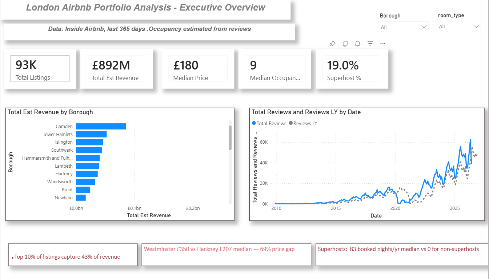
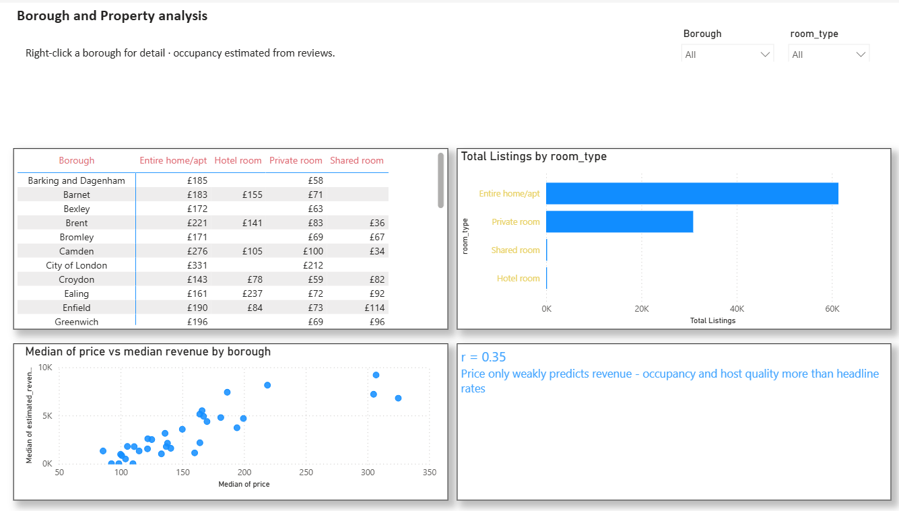
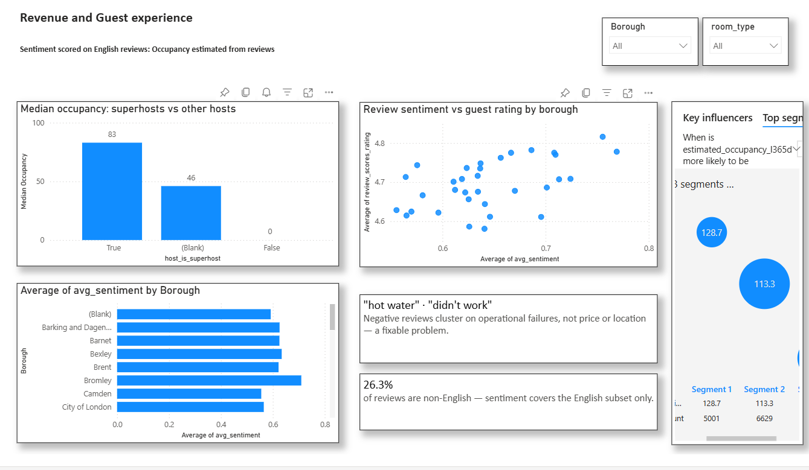
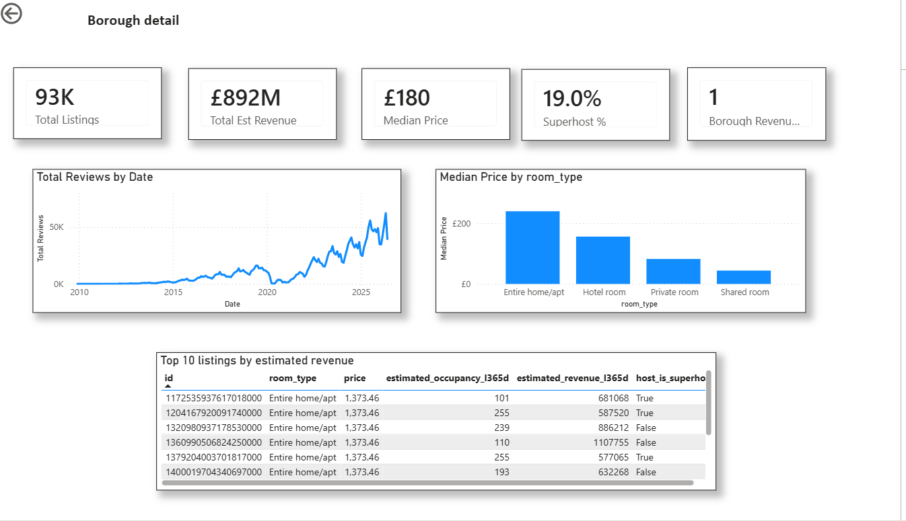

# London Airbnb Analysis

End-to-end analytics project: a Python data pipeline, a machine learning and NLP layer, and a multi-page Power BI dashboard, built to answer a real portfolio-management question over 92,638 London listings and 2.24M reviews.

## Problem

London short-let property managers operate in a highly saturated market where listing performance varies dramatically by borough, property type, and pricing strategy — making it hard to know which properties to acquire and how to price them.

## Stakeholder

The Head of Portfolio at a London property management company, who needs evidence on which listing characteristics drive higher occupancy, revenue, and guest satisfaction.

## Data source

[Inside Airbnb](https://insideairbnb.com) — London snapshot, June 2026. 92,638 listings and 2.24M reviews. Raw data is not committed due to size; the pipeline notebook reproduces it from the source files.

## Key findings

- **69% price gap** between the most and least expensive boroughs (Westminster £350 vs Hackney £207 median), with direct implications for acquisition cost and pricing.
- **Super hosts book far more** — a median of 83 booked nights/year versus 0 for non-Super hosts.
- **Revenue is highly concentrated** — the top decile of listings accounts for 43% of estimated revenue.
- **Price only weakly predicts revenue** (r = 0.35) — occupancy and host quality matter more than headline nightly rate.
- **Negative reviews cluster on operational failures** ("hot water", "didn't work"), not price or location — a fixable problem.
- **78% of reviews score as positive** on VADER sentiment, but 26.3% of reviews are non-English and aren't reliably scored by an English-tuned model, so that headline covers the English subset only.

## What's in the project

- **Data pipeline (Python):** ingestion, cleaning, auditing, and feature engineering to an analysis-ready dataset.
- **Machine learning:** Logistic Regression and Random Forest models predicting a `high performer` listing target.
- **NLP:** VADER sentiment analysis and TF-IDF over 2.24M reviews, including the non-English coverage audit above.
- **Dashboard (Power BI):** four-page report on a star-schema model with 20+ DAX measures, row-level security, drill-through, and AI visuals (Key Influencers).
- **Cloud version:** the pipeline re-implemented on Databricks using a medallion (bronze/silver/gold) architecture.

## Dashboard

<!-- Paste the Publish-to-web link on the next line once the tenant settings finish propagating. -->
**Live report:** [add Publish-to-web link here]

**Dashboard:** Full report exported as [dashboard/dashboard.pdf](dashboard/dashboard.pdf); page screenshots below; .pbix and PDF in /dashboard.

**Executive Overview** — KPIs, revenue by borough, review growth

**Borough & Property Analysis** — price by room type, price vs revenue (r = 0.35)

**Revenue & Guest Experience** — Super host occupancy, sentiment, Key Influencers, non-English caveat

**Borough Detail** — drill-through page with top listings by estimated revenue

## Folder structure

- `/notebooks` — `01_pipeline` (loading and verification), `02_cleaning` (audit, decisions, features), plus the ML and NLP notebooks
- `/data` — analysis-ready CSV
- `/sql` — analysis queries (`query1_borough_room_type_prices.sql`, `query2_superhost_performance.sql`, `query3_listings_reviews_join.sql`)
- `/dashboard` — Power BI `.pbix` file
- `/charts` — exported figures and dashboard screenshots

## Tech stack

Python (pandas, scikit-learn, NLTK/VADER), SQL, Power BI (DAX, Power Query), Databricks / Apache Spark.

## How to run

1. Download `listings.csv.gz` and `reviews.csv.gz` from Inside Airbnb into `data/raw/`.
2. `pip install -r requirements.txt`
3. Run the notebooks in order (Restart Kernel and Run All).

## Responsible AI

See [RESPONSIBLE_AI.md](RESPONSIBLE_AI.md) for intended use.
bias findings, and deployment conditions.